# TP : travail collaboratif avec Git et GitHub

---

## Objectifs du TP

1. Travailler à plusieurs sur le même dépôt distant GitHub.
2. Créer et résoudre des conflits.
3. Se familiariser avec l'utilisation de l'interface en ligne GitHub.
4. Se familiariser avec le jargon technique.

---

## Ressources

- [optionnelle, guide syntaxe Markdown, à utiliser pour faire la mise en page de vos fichiers markdown](https://docs.framasoft.org/fr/grav/markdown.html)

---

## Définitions

- ***Issue*** : équivalent d'un ***ticket***, on crée un *issue* généralement lorsqu'on souhaite affecter un développeur sur une tâche, ça peut être un bug, une nouvelle fonctionnalité, de la documentation etc... Généralement l'*issue* débouche sur la création d'une nouvelle branche portant le même nom.

- ***Pull/Merge request*** : il s'agit d'une demande de soumission de votre code (vos modifications sur un projet) au propriétaire du dépôt. pour que ce dernier puisse l'intègre sur la branche principale *main*.
Lorsque le propriétaire accepte votre travail, vos modifications seront *mergées*(intégrées) dans la branche principale *main*.
Lorsqu'il refuse, il vous donnera la raison du refus.
Chaque propriétaire impose ses propres exigences (généralement présent dans le fichier *`README.md`* à la racine du projet) en matière d'installation, technologies, versions, nommage des commits, qualité du code requise, tests unitaires, intégrations, d'acceptation, fonctionnelles etc.

- ***Assigner*** : désigner un collaborateur pour effectuer une tâche.
- ***Reviewer*** : désigner un collaborateur pour effectuer de la revue de code (revoir, vérifier, corriger votre code).

---

## Formation des groupes

- Groupe de 4 développeurs.
- Dans chaque groupe :
  - 1 *Owner*, créateur et propriétaire du dépôt distant ;
  - 3 *Collaborateurs* dont 1 binôme travaillant en *pair programming* (pour faire simple, un va exécuter les instructions données par l'autre)

---

## PARTIE 1

---

### Tâches du *owner* au lancement du projet

1. Depuis GitHub, Créez un dépôt nommé ***tp-food-git*** vide (aucun fichier, *ne pas cocher le add README.md*).
2. En local :

   2.1 Récupérez ou faites le lien avec le dépôt distant ;

   2.2 Créez les fichiers `README.md` et `.gitignore` ;

   2.3 Effectuez votre **premier commit** ;

   2.4 Renommez la branche *master* en *main* ;

   2.5 *Pushez*.

3. Depuis GitHub, invitez les 2 autres collaborateurs à participer au projet.

   - **Settings  > Access > Collaborators > add people**.
   - Saisissez leurs adresses e-mails.

##### Ilustration pour l'ajout des collaborateurs

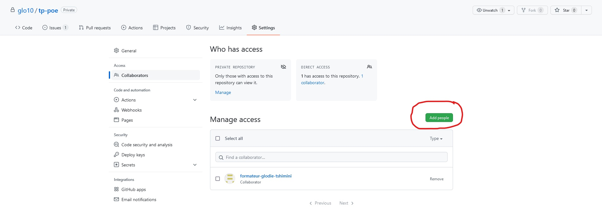

4. Depuis GitHub, Créez deux *issues* : 

   1. Première *issue* nommée ***feature/morning_menu*** et assignez au premier développeur (développeur 1).
   
   2. Deuxième *issue* nommée ***feature/lunch_menu*** et assignez au second développeur (développeur 2).

##### Illustration création d'un *issue*

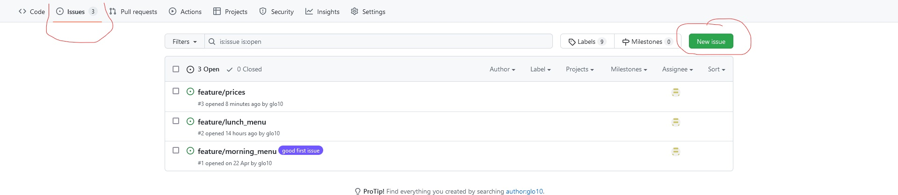
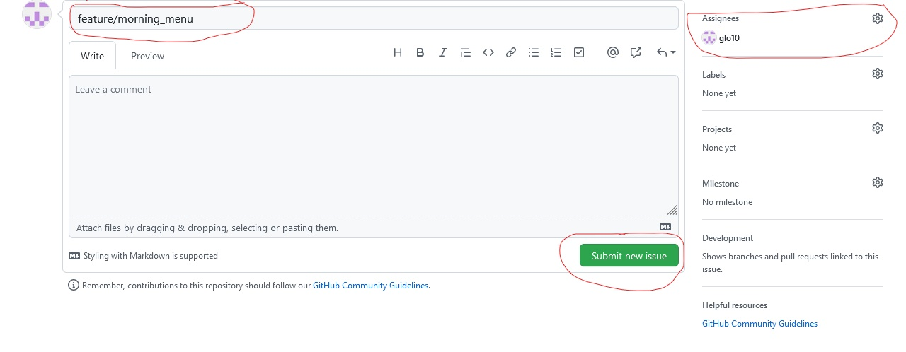

### Tâches du *owner* après le lancement du projet

***Attendre de recevoir les demandes de pull requests des autres développeurs avant de faire la suite.***

5. Depuis GitHub, acceptez ou rejetez les demandes  *pull requests* des développeurs.
   - En cas de rejet, indiquez au(x) développeur(s) le(s) motif(s) en utilisant le champ de commentaire proposé par GitHub ;
6. En local, uniquement en cas d'acceptation des modifications :
- Récupérez toutes modifications (branches) ;
- *Mergez* la branche du développeur qui a soumis la demande de *pull request* ;
- Résolvez les éventuels conflits ;
- *Pushez* sur la branche *main*.

##### Illustration du traitement de la demande de pull-request (merge pull request)

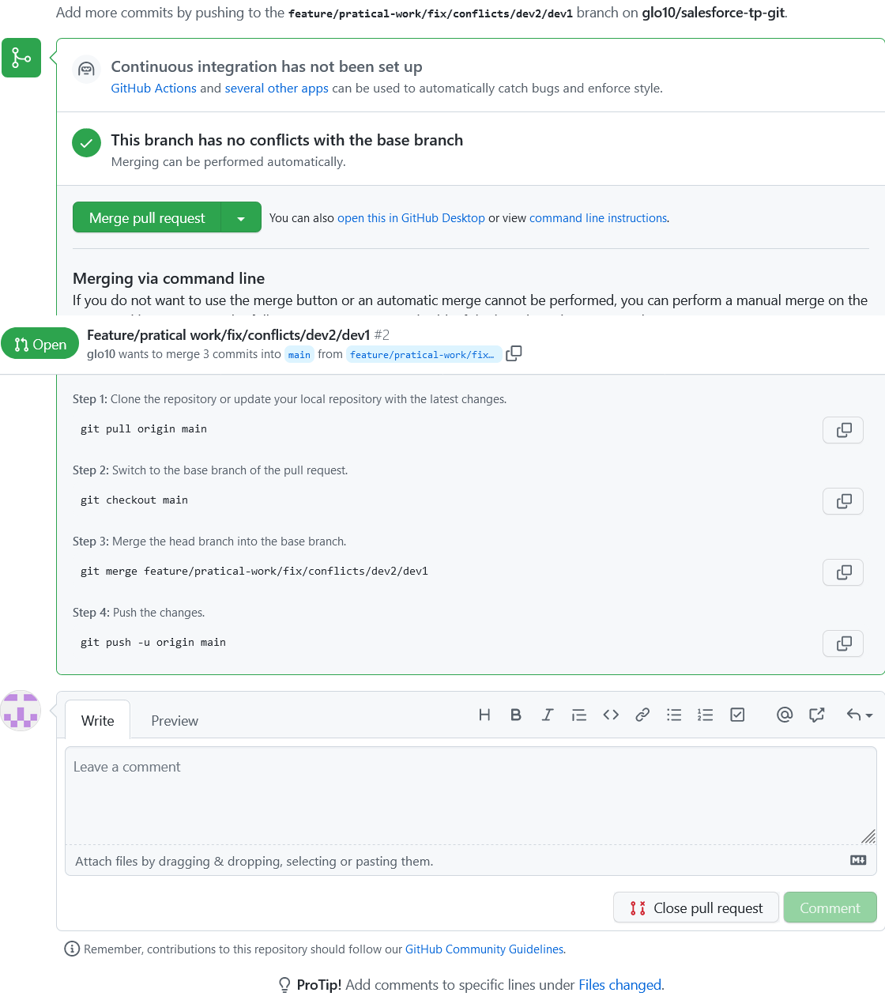
  
7. Depuis GitHub, après avoir effectué les *merge requests* des travaux des développeurs sur la branche *main*.

   1. Créez une *issue* nommée ***feature/prices*** et assignez-le à vous-même.

   2. Créez une nouvelle branche qui porte le même nom que l'*issue* depuis l'onglet ***Issues***, **attention** à bien renommer le nom de la branche pour avoir exactement le même nom que celui de l'*issue*.

##### Illustration création d'une branche à partir de l'onglet *Issues*

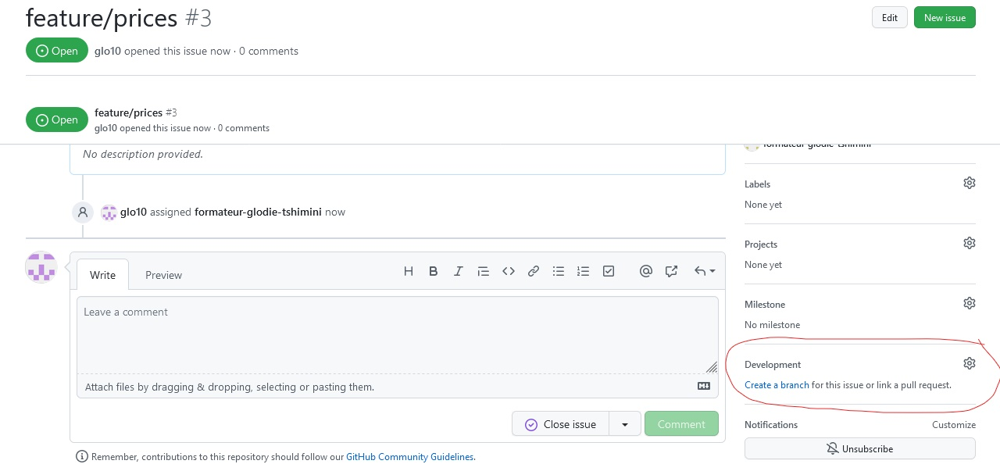
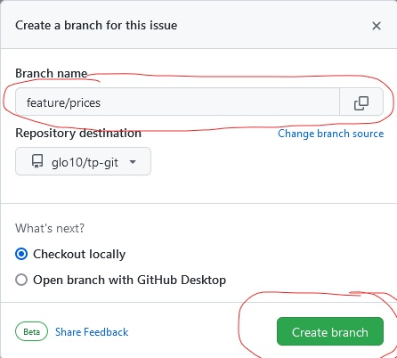

8. En local :

8.1 Créez et récupérez la branche *feature/prices* ;
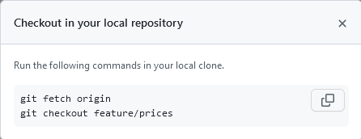

8.2 Ajoutez les prix aux produits présents sur chaque ligne des fichiers ***menu.md*** et ***drink.md*** ;

8.3 *Pushez* vos modifications sur le dépôt distant ;

8.4  Effectuez un *merge request* de cette branche dans la branche *main* en assignant l'un des développeurs pour effectuer de la revue de code ;

9. Prévenez vos collaborateurs de l'ajout des prix.

---

### Tâches du premier développeur (ou binôme en pair programming) au lancement du projet

1. Depuis votre boite de messagerie ou GitHub, acceptez l'invitation reçue.
2. Depuis GitHub, créez une nouvelle branche à partir de l'*issue* qui vous a été assignée, **attention** renommez le nom de la branche pour qu'elle soit identique au nom de l'*issue*.

Depuis l'onglet issue
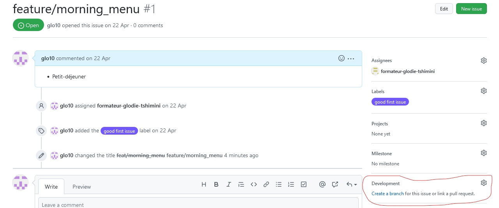
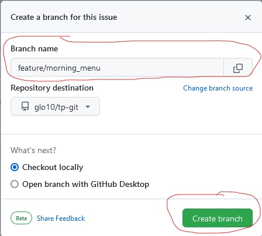

3. En local, créez une nouvelle branche portant le même nom que l' *issue* à l'aide de la commande suivante.
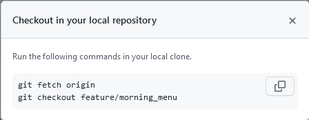

4. **En local, à la racine du projet**

4.1 Créez un fichier nommé ***`menu.md`*** qui doit lister vos viennoiseries préférées (une viennoiserie par ligne).

4.2  Créez un fichier nommé ***`drink.md`*** contenant vos boissons favorites pour le petit-déjeuner (une boisson par ligne).

5. En local, ***commitez et pushez*** sur la branche *feature/morning_menu*.

6. Depuis GitHub, faites une demande de *pull request* :

6.1 En mettant le *développeur 2* en tant que ***Reviewers*** pour la revue du code;

6.2 Assignez le *owner* dans ***Assignees*** ;

6.3 Ajoutez un petit commentaire pour expliquer votre travail.

##### Illustration pour la demande de pull-request

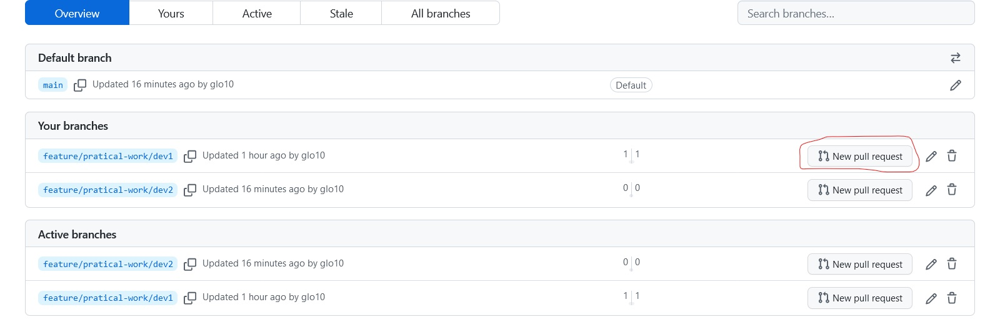

---

### Tâches du premier développeur (ou premier binôme en pair programming) après l'ajout des prix par le *owner*

***Attendre d'être notifié par le owner de l'ajout des prix avant de faire la suite.***

7. En local, après avoir été notifié de l'ajout des prix par le *owner*.

7.1 Récupérez toutes les modifications effectuées sur le dépôt distant.

7.2 En cas de conflits, gérez-les en communiquant avec vos collaborateurs.

---

### Tâches du second développeur (ou second binôme en pair programming) au lancement du projet

1. Depuis votre boite de messagerie, acceptez l'invitation reçue.
2. Depuis GitHub, créez une nouvelle branche à partir de l'*issue* qui vous a été assignée, **attention** renommez le nom de la branche pour qu'elle soit identique au nom de l'*issue*.

Depuis l'onglet issue

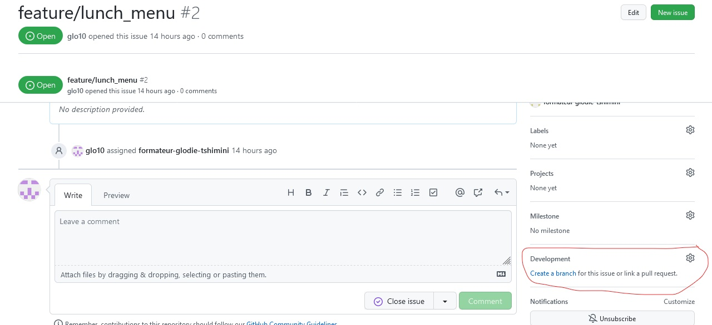
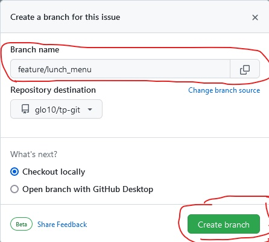

3. En local, créez une nouvelle branche portant le même que l'*issue* à l'aide de la commande suivante.
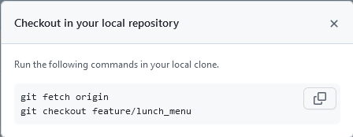

4. **En local, à la racine du projet**

4.1 Créez un fichier nommé ***`menu.md`*** listant vos plats préférés (un plat par ligne).

4.2 Créez un fichier nommé ***`drink.md`*** contenant vos boissons favorites pour accompagner vos plats (une boisson par ligne).

5. En local, *commitez et pushez* sur la branche *feature/lunch_menu*.

6. Depuis GitHub, faites une demande de *pull request* :

6.1 En mettant le *développeur 1* en tant que ***Reviewers*** pour la revue du code;

6.2 Assignez le *owner* dans ***Assignees*** ;

6.3 Ajoutez un petit commentaire pour expliquer votre travail ;

##### Illustration pour la demande de pull-request

### Tâches du second développeur (ou binôme en pair programming) après l'ajout des prix par le *owner*

***Attendre d'être notifié par le owner de l'ajout des prix avant de faire la suite.***

7. En local, après avoir été notifié de l'ajout des prix par le *owner*.

7.1 Récupérez toutes les modifications effectuées sur le dépôt distant.

7.2 En cas de conflit, gérez-les en communiquant avec vos collaborateurs.